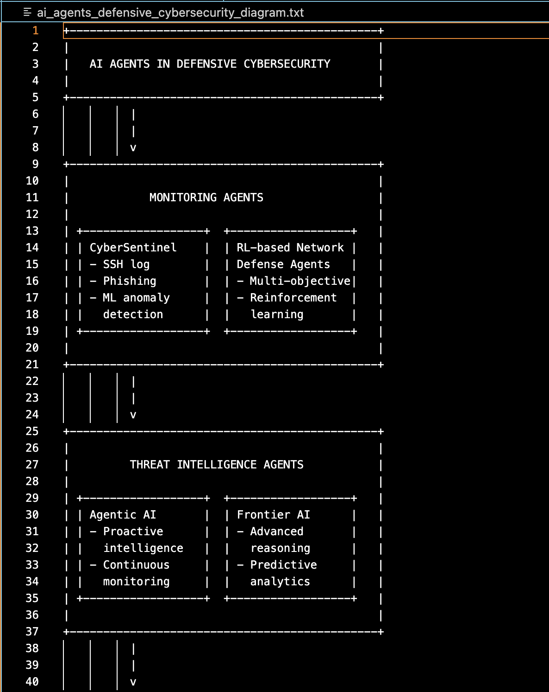
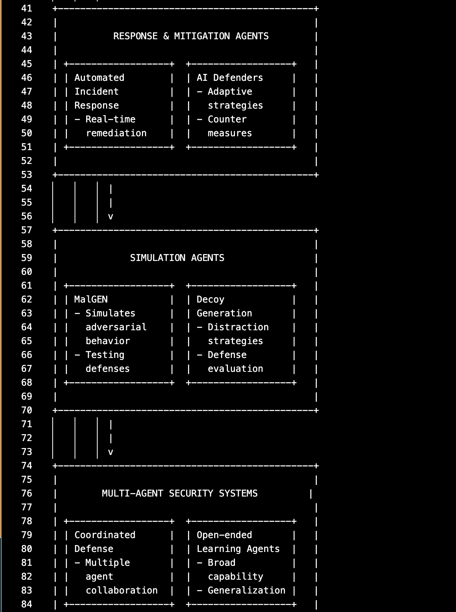
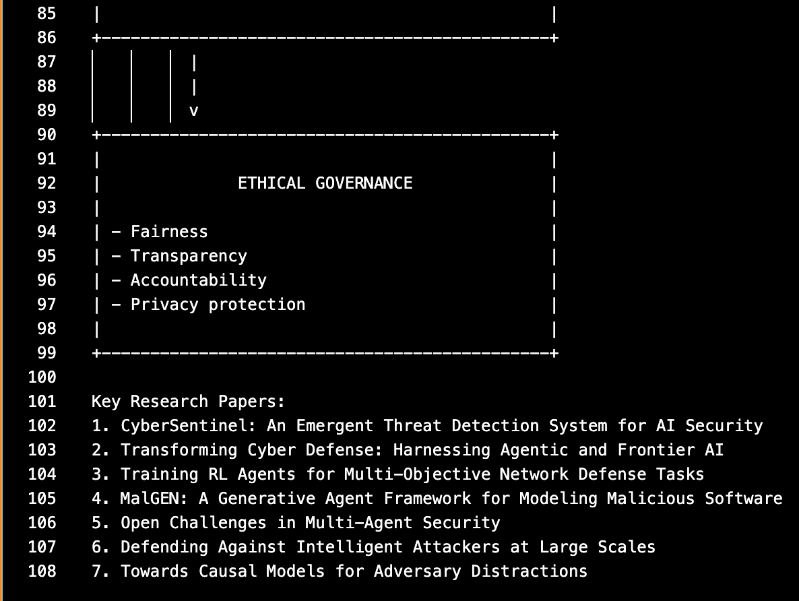

# AI Research Agent

A Python-based research agent that uses the Model Context Protocol (MCP) to search, store, and analyze academic papers from arXiv. The agent provides both a command-line chatbot interface and Jupyter notebook integration for interactive research workflows.

<div style="text-align: center;">
  
</div>

## Features

- **Paper Search**: Search arXiv for academic papers by topic
- **Information Storage**: Automatically store paper metadata and summaries locally
- **Interactive Chat**: Command-line chatbot interface with Claude integration
- **Resource Management**: Browse and access stored papers by topic
- **Prompt Templates**: Pre-built prompts for research analysis
- **MCP Integration**: Uses Model Context Protocol for extensible tool integration

## Project Structure

```
research-agent-mcp/
├── mcp_chatbot.py              # Main chatbot interface
├── research_server.py          # MCP server for research tools
├── research_agent_mcp.ipynb    # Jupyter notebook interface
├── server_config.json          # MCP server configuration
├── requirements.txt            # Python dependencies
├── .env.example                # Environment variables template
├── papers/                     # Stored research papers (auto-generated)
└── images/                     # Documentation images
```

## Setup

1. **Clone the repository**
   ```bash
   git clone https://github.com/yauheniya-ai/research-agent-mcp
   cd research-agent-mcp
   ```

2. **Create virtual environment**
   ```bash
   uv venv --python=3.10
   source .venv/bin/activate  # Mac/Linux
   # .venv\Scripts\activate   # Windows
   ```

3. **Install dependencies**
   ```bash
   uv pip install -r requirements.txt
   ```

4. **Configure environment**
   ```bash
   cp .env.example .env
   # Edit .env and add your Anthropic API key
   ```

## Usage

### Command Line Chatbot

The chatbot is launched from within the Jupyter notebook using a terminal interface:

1. Start Jupyter Lab:
   ```bash
   jupyter lab
   ```

2. Open `research_agent_mcp.ipynb` and follow the instructions to launch the inspector and the chatbot interface

### Available Tools

- **search_papers(topic, max_results)** - Search arXiv for papers on a topic
- **extract_info(paper_id)** - Get detailed information about a specific paper
- **Resource access** - Browse stored papers by topic folders

### Available Commands
- `@folders` - View available research topics
- `@<topic>` - Browse papers in a specific topic
- `/prompts` - List available prompt templates
- `/prompt <name> <args>` - Execute a prompt template
- `quit` - Exit the chatbot

### Example queries
```
   - `/prompt generate_search_prompt topic="ai_agents_in_defensive_cybersecurity"`
   - `create a visual diagram of the available ai agents in defensive cybersecurity based on the retrieved papers and save it to a text file`
```

## Configuration

The `server_config.json` file configures MCP servers:
- **research** - Custom research tools server
- **filesystem** - File system access
- **fetch** - Web content fetching

## Output

Research results are stored in topic-specific folders under `papers/`:
```
papers/
├── ai_agents_defensive_cybersecurity/
│   └── papers_info.json
└── machine_learning_security/
    └── papers_info.json
```

Each `papers_info.json` contains structured metadata for all papers in that topic, including titles, authors, summaries, and PDF URLs.

### Example Output
Query: `create a visual diagram of the available ai agents in defensive cybersecurity based on the retrieved papers and save it to a text file`  
Output: `ai_agents_defensive_cybersecurity_diagram.txt`

<div style="text-align:center; font-size:0;">
   
   
   
</div>

## Requirements

- Python 3.10+
- Anthropic API key
- Internet connection for arXiv access

## License

MIT License